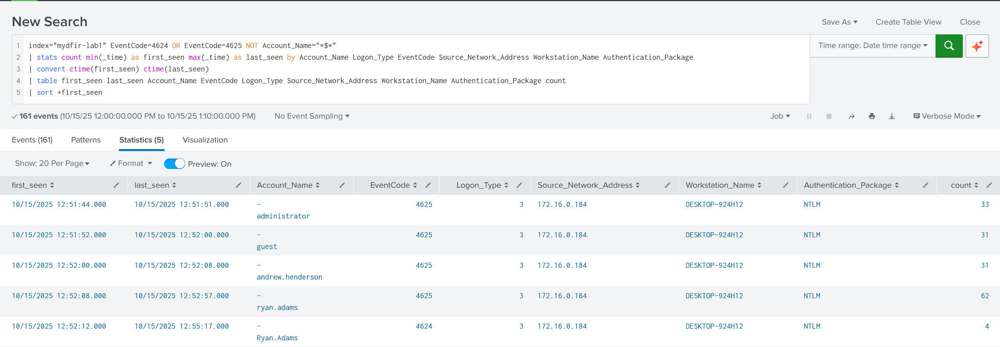
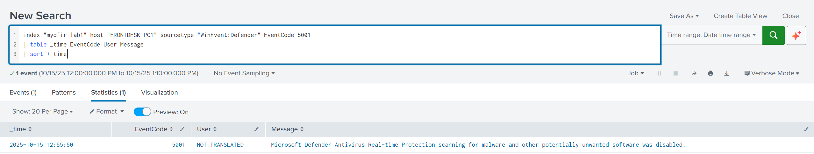
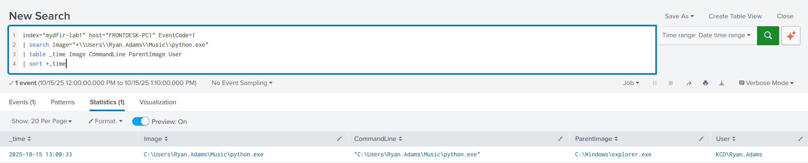
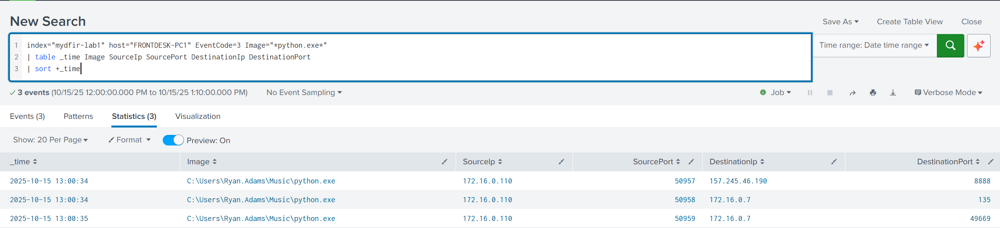
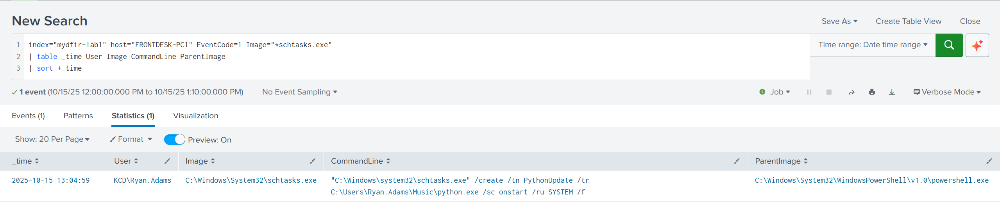
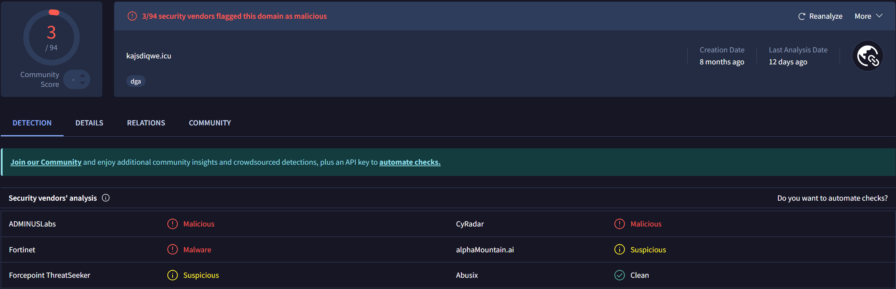
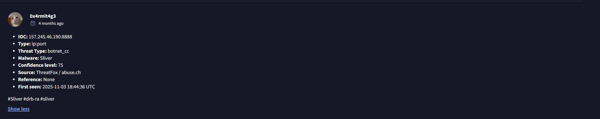

# Password Spray → C2 Compromise Investigation

End-to-end SOC investigation of a simulated compromise on **FRONTDESK-PC1 (Kerning City Dental)**.

---

## Project Overview

Analyzed a full intrusion chain after suspicious activity was reported on an endpoint. Using Splunk, Windows Event Logs, Sysmon, Zeek, and Suricata, I traced the attack from password spraying to NTLM compromise, privilege escalation, payload execution, persistence, and Sliver C2 communication.  

Reconstructed the full attack timeline, identified IOCs, validated malicious infrastructure using OSINT (VirusTotal, AbuseIPDB), and mapped activity to MITRE ATT&CK.  

This project demonstrates end-to-end SOC investigation capability, including alert triage, log correlation, attack reconstruction, and incident reporting.

---

## Key Findings

- Password spraying led to successful NTLM compromise  
- Immediate privilege escalation following authentication  
- Microsoft Defender disabled under SYSTEM  
- Malicious `python.exe` payload executed from user directory  
- C2 communication established to external infrastructure (Sliver)  
- Persistence via scheduled task (`PythonUpdate`)  
- Lateral movement attempted but unsuccessful  

---

## Tools & Technologies

Splunk, Sysmon, Windows Event Logs, Zeek, Suricata, MITRE ATT&CK  
VirusTotal, AbuseIPDB, ThreatFox  

---

## Investigation Highlights

- Correlated endpoint, authentication, and network telemetry  
- Reconstructed full attack timeline from initial access to persistence  
- Identified IOCs (IP, domain, file hash, payload path)  
- Built detection logic for brute-force activity, execution, and C2 behavior  
- Validated malicious infrastructure using OSINT (VirusTotal, AbuseIPDB)  
- Mapped activity to MITRE ATT&CK (11 techniques across 8 tactics)  

---

## Detection Logic

| Detection | Data Source | Description |
|----------|------------|-------------|
| Password Spraying | Windows Event Logs (4625) | Multiple failed logons from a single source across multiple accounts |
| Successful NTLM Logon | Event ID 4624 (Type 3) | Network logon following password spray indicating account compromise |
| Privileged Logon | Event ID 4672 | Special privileges assigned immediately after authentication |
| Defender Tampering | Event IDs 5001, 5007 | Microsoft Defender Real-Time Protection disabled |
| Suspicious Process Execution | Sysmon Event ID 1 | `python.exe` executed from user-writable directory |
| C2 Communication | Sysmon 3 / Zeek / Suricata | Outbound connections to known malicious IP over uncommon ports |

---

## Investigation Evidence

### 1. Initial Access — Password Spraying

### 2. Defense Evasion — Defender Disabled

### 3. Payload Execution

### 4. Command & Control (C2)

### 5. Persistence Mechanism

### 6. Threat Intelligence — AbuseIPDB

### 7. Threat Intelligence — VirusTotal (Domain Reputation)

### 8. Threat Intelligence — VirusTotal (Detection Ratio)

### 9. Threat Intelligence — Sliver C2 Association

---

## Lessons Learned

- Correlating Windows, Sysmon, Zeek, and Suricata logs was critical to tracking the attack end-to-end  
- Weak account lockout policies enabled successful password spraying  
- Privileged access immediately after login is a high-risk indicator  
- Defender tampering (EventCode 5001) served as a key pivot point in the investigation  
- Execution from user-writable directories remains a common attacker technique  
- Combining endpoint, authentication, and network data helped validate attempted lateral movement  
- OSINT validation confirmed the external infrastructure was linked to Sliver C2  
- ATT&CK mapping exposed detection and alerting gaps  

---

## Artifacts

- Full SOC investigation report — [**FRONTDESK-PC1 Compromise_Report.pdf**](https://github.com/aksec88/splunk-soc-investigation-lab/blob/main/FRONTDESK%E2%80%91PC1%20Compromise_Report.pdf)   
- **spl_queries.txt** — SPL queries used  

---

*All analysis performed on simulated lab data as part of the MyDFIR Splunk-101 Capstone.*

