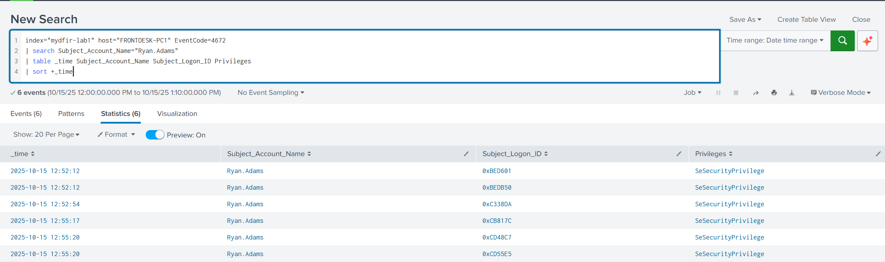
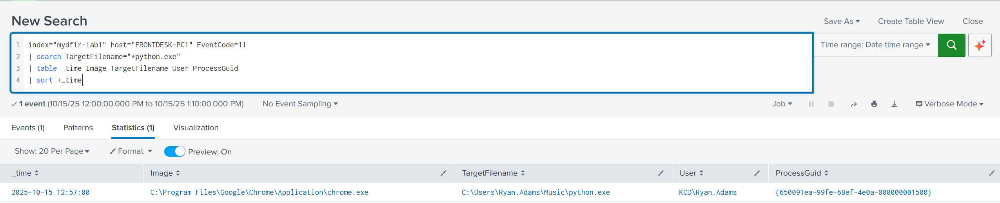
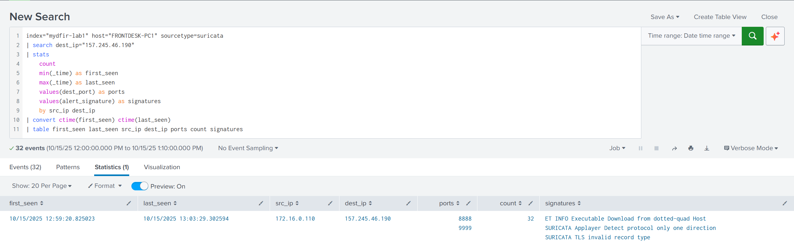
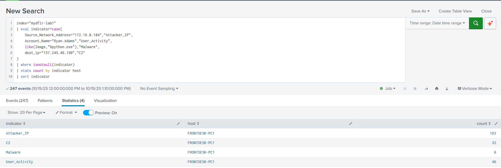

# Password Spray to Endpoint Compromise and C2 (Sliver)

## Scenario

A local administrator at Kerning City Dental (KCD) reported unexpected mouse movement on his workstation at approximately 13:00 UTC on October 15, 2025. I conducted a full SOC investigation using Splunk to analyze authentication, process, file, and network telemetry, identify indicators of compromise, and reconstruct attacker activity following a password spraying intrusion that led to endpoint compromise and Sliver C2 communication.

## Tools & Technologies

- ***Splunk (SIEM):*** Centralized log aggregation, querying, correlation, and timeline reconstruction
- **Sysmon**: Endpoint telemetry for process execution, file creation, and network connections
- ***Windows Event Logs***: Authentication, authorization, privilege activity and security control activity
- ***Zeek***: Network protocol and connection analysis
- ***Suricata***: IDS alerts validating malicious traffic and C2 behavior
- ***VirusTotal, AbuseIPDB, ThreatFox***:Threat intelligence and IOC validation
- ***MITRE ATT&CK / D3FEND***: Offensive and defensive technique mapping

## Attack Chain

```
Password Spray → Account Compromise → Privilege Escalation → Defender Disabled → Payload Download → Execution → C2 Established → Lateral Movement Attempt → Persistence
```

## Skills Learned

- Analyzing Windows Security, Sysmon, Zeek, and Suricata logs using Splunk
- Correlating authentication, process, file, and network telemetry to reconstruct attacker activity
- Identifying attacker behavior across the full intrusion lifecycle (initial access → C2 → persistence)
- Validating incident scope, containment, and potential lateral movement
- Enriching findings with threat intelligence to confirm malicious infrastructure
- Mapping attacker actions to detection opportunities and SOC alerting gaps

## Investigation Methodology

### Step 1: Establish Scope
Reviewed 7,013 events across 8 log sources and 53 event codes to determine available visibility.

### Step 2: Authentication Analysis
Identified a password spraying attack from 172[.]16[.]0[.]184 targeting four accounts, resulting in 157 failed attempts within 73 seconds. A successful NTLM logon for Ryan.Adams at 12:52:12 confirmed account compromise. Validated that the compromised account was immediately granted administrative privileges.




### Step 3: Defense Evasion
Confirmed Windows Defender Real-Time Protection was disabled under SYSTEM context shortly after compromise, reducing detection capability prior to payload execution.


### Step 4: Payload Delivery & File Activity
Determined that the payload (python.exe) was downloaded via Chrome and written to a non-standard user-writable directory, indicating browser-based delivery.



### Step 5: Process Execution & Attacker Activity
Validated execution of the payload from the user directory, followed by interactive PowerShell activity consistent with hands-on-keyboard attacker control.


### Step 6: Network Activity & C2 Communication
Identified outbound connections to 157[.]245[.]46[.]190 on ports 8888 and 9999, consistent with Sliver C2 infrastructure. Observed internal RPC traffic to 172[.]16[.]0[.]7, indicating reconnaissance but no successful lateral movement.


### Step 7: IDS Correlation
Suricata alerts confirmed malicious activity, including executable download from a dotted-quad host and anomalous TLS behavior associated with the C2 IP.



### Step 8: Persistence Mechanism
Identified a scheduled task named "PythonUpdate" configured to execute the payload as SYSTEM at startup, confirming persistence.


### Step 9: Lateral Movement Validation
Correlated authentication, process, and network events across hosts and confirmed all malicious activity was contained to FRONTDESK-PC1.



### Step 10: Threat Intelligence (OSINT)
Validated the external infrastructure using VirusTotal, AbuseIPDB, and ThreatFox. The C2 IP and associated domain were confirmed malicious and linked to Sliver C2 operations.


## MITRE ATT&CK Mapping

| Tactic | Technique | ID | Evidence |
|---|---|---|---|
| Initial Access | Password Spraying | T1110.003 | 157 failed authentication attempts from 172[.]16[.]0[.]184 across multiple accounts within 73 seconds |
| Initial Access | Valid Accounts | T1078.002 | Successful NTLM logon (Type 3) using compromised account Ryan.Adams from 172[.]16[.]0[.]184 |
| Execution | User Execution | T1204 | Malicious binary python.exe executed from user-writable directory |
| Execution | Command and Scripting Interpreter (PowerShell) | T1059.001 | Interactive PowerShell sessions observed post-compromise |
| Persistence | Scheduled Task | T1053.005 | Scheduled task PythonUpdate created to execute payload as SYSTEM at startup |
| Defense Evasion | Impair Defenses | T1562.001 | Microsoft Defender Real-Time Protection disabled under SYSTEM context (EventCode 5001) |
| Defense Evasion | Masquerading | T1036 | Payload named python.exe stored in non-standard path: C:\Users\Ryan.Adams\Music\ |
| Command and Control | Ingress Tool Transfer | T1105 | Payload downloaded via Chrome from external IP 157[.]245[.]46[.]190 |
| Command and Control | Application Layer Protocol | T1071 | C2 communication over TCP ports 8888 and 9999 using direct IP (no DNS) |
| Discovery | Remote System Discovery | T1018 | Internal RPC probing to 172[.]16[.]0[.]7 (port 135) |
| Lateral Movement | Remote Services | T1021 | RPC connections to 172[.]16[.]0[.]7 (ports 135, 49669); no successful movement observed |

8 tactics, 11 techniques observed.

## Detection Opportunities

- High-volume failed logons from single source (EventCode 4625)
- NTLM network logon activity (Logon Type 3)
- Privileged logon events (EventCode 4672)
- Windows Defender tampering or disable events (EventCode 5001)
- Execution of binaries from user-writable directories
- Outbound traffic to known malicious IP addresses
- Creation or modification of scheduled tasks

## Lessons Learned
- Lack of account lockout enabled password spraying  
- Administrative privileges increased impact  
- Disabling Defender reduced visibility  
- Execution from user directories remains high‑risk  
- Early user reporting helped contain the incident  

## Additional Resources
***View Full Incident Report

- [KCD SOC Incident Report: FRONTDESK-PC1 Compromise](report/KCD_SOC_Incident_Report.pdf)

## Author

**Abdul Kuyateh** — SOC Analyst

---

*This project was completed as part of the MyDFIR Splunk 101 Capstone. All analysis was performed on simulated lab data.*
